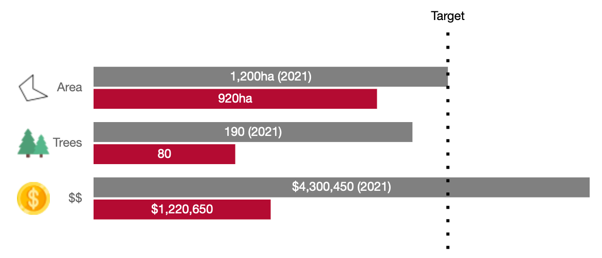

# VizComponents

**Vizualisation components for Hydronet**

These components are designed to be used in a django project. 
Check out the test_viz_components directory for sample code for how to use the available widgets.
See localhost:8000/all/ for an overview of available components.

Typical usage within a django project would be to include one or more viz components within the html template by
utilizing the template tags provided as part of viz_components. 

viz_components.js, as well as external javascript and/or css utilized by the viz components but not included
in the viz_components distribution should also be included here. E.g.
define a template file <yourtemplate>.html:
```

<!DOCTYPE html>
<html lang="en">
  <head>
    ...
     <!-- load style sheets, potentially define custom viz-component styles ... -->
     <link rel="stylesheet" type="text/css" href=""/>
  </head>
  <body>
    <!-- load any external scripts needed for component generation, e.g., the bar chart widget utilizes 
          chart.js, which is not included in the viz components distribution -->
    <script src="https://cdn.jsdelivr.net/npm/chart.js@4.2.1/dist/chart.min.js"></script>

    <!-- add template string(s) for the viz component(s), e.g. to create a bar chart -->
    { % bar_chart barchart.canvas_id barchart.chartdata barchart.chartopts %}

  </body>
</html>
```

then create a view utilizing the dataclass generators provided as part of the viz_components distribution
to parameterize the widget, e.g.

```

from django.shortcuts import render
from viz_components.bar_chart import BarChart

def bar_view(request):
    chartdata = BarChart( ... )
    return render(request, '<yourtemplate>.html', dict(barchart = chartdata,))

```

<hr>

### ******Available Components******

**Delta Arrow:**


An up- or down- arrow designed to represent change in a metric, drawn using html canvas.

* Python data generator class: _Arrow_
* Template tag: _arrow_
* Parameters for template tag: _canvas_id, data_
  Parameters are provided as attributes by the _Arrow_ class.
* Sample usage:  where _ds_ in an instance of _Arrow_
* Requirements: none


**Progress Bar:**


A progress bar that may potentially include multiple components representing different 
stages of progress towards a goal, or multiple components progressing towards component-specific sub-goals.
Utilizes the bootstrap progress bar component.

* Pyton data generator classes:
  * _ProgressBar_ (for one component or stage)
  * _Progress_ (to collect components into a single bar)
* Template tag: _progress_bar_
* Parameters for template tag: typically a _Progress_ instance,
    but can also take a single _ProgressBar_ or a list of _ProgressBars_.
* Sample usage:  where _proj_progress_ is 
an instance of _Progress_
* Requirements: bootstrap (tested on bootstrap 3)


**Simple Progress Bar:**


A progress bar that shows progress in a single metric towards a goal.
Utilizes the bootstrap progress bar component.

* Pyton data generator class: _ProgressBar_
* Template tag: _simple_progress_bar_
* Parameters for template tag: a single _ProgressBar_ instance
* Sample usage:  where _proj_progress_ is 
an instance of _ProgressBar_ 
* Requirements: bootstrap (tested on bootstrap 3) 

**Doughnut Chart**


A doughnut chart with optional center text. Implemented using chart.js.

* Python data generator class: _DoughnutChart_
* Template tag: _doughnut_chart_
* Parameters for template tag: _canvas_id, chartdata, chartopts_, 
    all of which are provided as attributes by _DoughnutChart_
* Sample usage:
    where dd is an instance of DoughnutChart
* Requirements: 
  * chart.js (tested on version 4.2.1)
  * doughnutlabel-v3 plugin from https://github.com/FreedomRings/chartjs-plugin-doughnutlabel-v3


**Stacked Doughnut Chart**


A doughnut chart with optional center text and multiple rings representing a breakdown into
a set of two hierarchical categories. Implemented using chart.js.

* Python data generator class: _StackedDoughnutChart_
* Template tag: _stacked_doughnut_chart_
* Parameters for template tag: _canvas_id, chartdata, chartopts_, 
    all of which are provided as attributes by _StackedDoughnutChart_
* Sample usage:
    where dd is an instance of StackedDoughnutChart
* Requirements: 
  * chart.js (tested on version 4.2.1)
  * doughnutlabel-v3 plugin from https://github.com/FreedomRings/chartjs-plugin-doughnutlabel-v3


<hr>

**Bar Chart**



A specialized bar chart that compares a set of metrics to benchmarks. (E.g.,
metrics in current year vs metrics in previous year).
Both the metrics and the benchmarks are represented by horizontal bars.
An optional target line can be added to show metrics also in relation to
that target. Implemented using chart.js.

* Python data generator class: _BarChart_
* Template tag: _bar_chart_
* Parameters for template tag: _canvas_id, chartdata, chartopts_, 
    all of which are provided as attributes by _BarChart_
* Sample usage:
    where dd is an instance of _BarChart_
* Requirements: chart.js (tested on version 4.2.1)

<hr>

Several of the components defined in this module utilize chart.js to do part or all of the work on the client side.
The general design principle for the API of these components is that the javascript part of the component takes
the data structures required to parameterize chart.js as parameters. 
The python classes utilized to generate the data for the javascript
components produce the equivalent of the data structures required by chart.js in python, 
then dump to json for import on the client side. 
It is therefore possible to bypass the python dataclass and build the appropriate 
chart.js data structures from scratch in the view, if desired.


